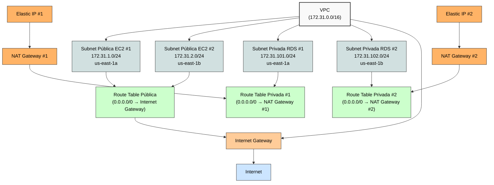

# Projeto de Infraestrutura como Código com Terraform na AWS

Este projeto utiliza o Terraform para provisionar e gerenciar recursos na AWS de forma automatizada e declarativa.

## O que é Terraform?

Terraform é uma ferramenta de infraestrutura como código (IaC) que permite definir e provisionar infraestrutura de forma declarativa. Com o Terraform, você escreve código que define os recursos que deseja criar, modificar ou excluir, e o Terraform se encarrega de executar essas operações.

## Estrutura do Projeto

```
iac-terraform-aws/
├── main.tf           # Arquivo principal com definições de recursos
├── variables.tf      # Declaração de variáveis
├── outputs.tf        # Saídas do Terraform
├── terraform.tfvars  # Valores das variáveis
└── modules/          # Módulos reutilizáveis
```

## Comandos Básicos do Terraform

### Inicialização

```bash
terraform init
```

O comando `terraform init` inicializa o diretório de trabalho do Terraform:
- Baixa e instala os providers necessários (AWS, neste caso)
- Inicializa o backend para armazenar o estado
- Baixa e instala módulos referenciados

### Formatação

```bash
terraform fmt
```

O comando `terraform fmt` formata automaticamente o código Terraform para seguir as convenções recomendadas:
- Alinha e organiza blocos de código
- Padroniza indentação e espaçamento
- Facilita a manutenção e leitura do código

### Validação

```bash
terraform validate
```

O comando `terraform validate` verifica se a configuração é sintaticamente válida e internamente consistente:
- Verifica erros de sintaxe
- Valida referências entre recursos
- Confirma se os tipos de variáveis estão corretos

### Planejamento

```bash
terraform plan
```

O comando `terraform plan` cria um plano de execução:
- Compara o estado atual com o estado desejado
- Mostra as alterações que serão realizadas (criar, modificar, destruir)
- Permite revisar as mudanças antes de aplicá-las
- Não faz nenhuma alteração real na infraestrutura

### Aplicação

```bash
terraform apply
```

O comando `terraform apply` implementa as alterações planejadas:
- Executa primeiro um `plan` e pede confirmação
- Cria, modifica ou destrói recursos conforme necessário
- Atualiza o arquivo de estado com as mudanças realizadas
- Pode ser usado com `-auto-approve` para pular a confirmação

### Destruição

```bash
terraform destroy
```

O comando `terraform destroy` remove todos os recursos gerenciados pelo Terraform:
- Destrói todos os recursos criados pelo Terraform
- Atualiza o arquivo de estado
- Útil para ambientes temporários ou de teste

## Boas Práticas

1. **Controle de Versão**: Mantenha seus arquivos Terraform em um repositório Git.
2. **Módulos**: Use módulos para reutilizar código e manter a organização.
3. **Variáveis**: Parametrize suas configurações usando variáveis.
4. **Estado Remoto**: Configure um backend remoto para armazenar o estado (S3, por exemplo).
5. **Workspace**: Use workspaces para gerenciar múltiplos ambientes.
6. **Documentação**: Documente seus recursos e módulos.

## Como Iniciar

1. Configure suas credenciais da AWS:
   ```bash
   export TF_AWS_ACCESS_KEY_ID="sua-access-key"
   export TF_AWS_SECRET_ACCESS_KEY="sua-secret-key"
   ```

2. Inicialize o projeto:
   ```bash
   terraform init
   ```

3. Planeje as mudanças:
   ```bash
   terraform plan
   ```

4. Aplique as mudanças:
   ```bash
   terraform apply
   ```

## Recursos Adicionais

- [Documentação Oficial do Terraform](https://www.terraform.io/docs)
- [Terraform Registry](https://registry.terraform.io/)
- [Provider AWS](https://registry.terraform.io/providers/hashicorp/aws/latest/docs)
